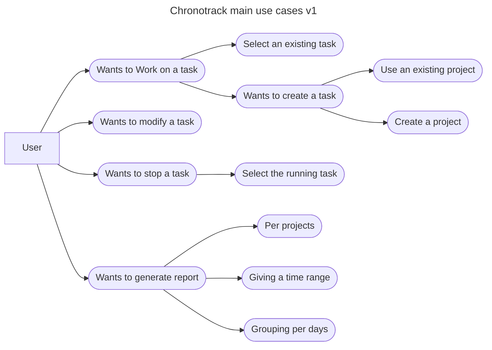

# Chronotrack Use Cases V1

```mermaid
---
title: Chronotrack main use cases v1
---
flowchart LR
    actor["User"] --> want_to_work([Wants to Work on a task])
    want_to_work --> select_task([Select an existing task])
    want_to_work --> want_to_create_task([Wants to create a task])
    want_to_create_task --> use_existing_project([Use an existing project])
    want_to_create_task --> create_a_project([Create a project])
    actor --> wants_to_modify_task([Wants to modify a task])

    actor --> want_to_stop([Wants to stop a task])
    want_to_stop --> select_running_task([Select the running task])

    actor --> want_to_generate_report([Wants to generate report])
    want_to_generate_report --> per_project([Per projects])
    want_to_generate_report --> range([Giving a time range])
    want_to_generate_report --> grouping_per_days([Grouping per days])
```